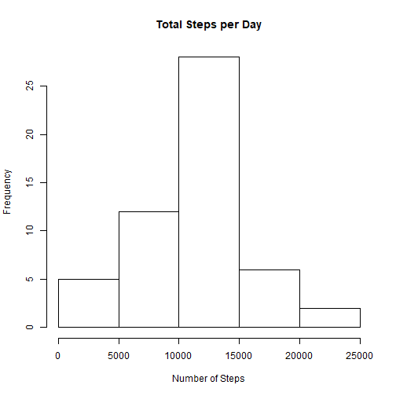
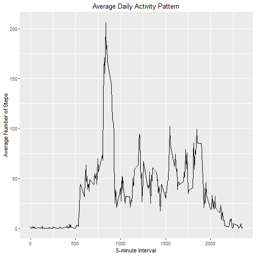
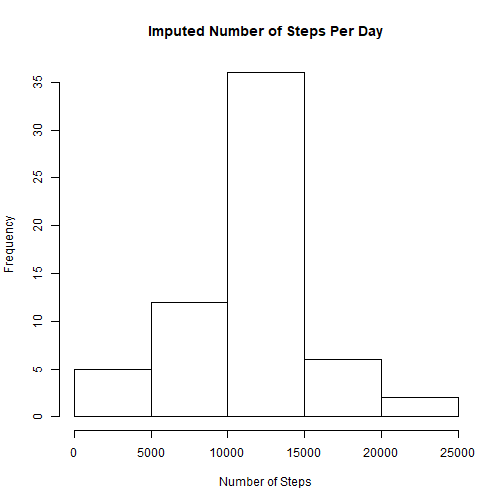
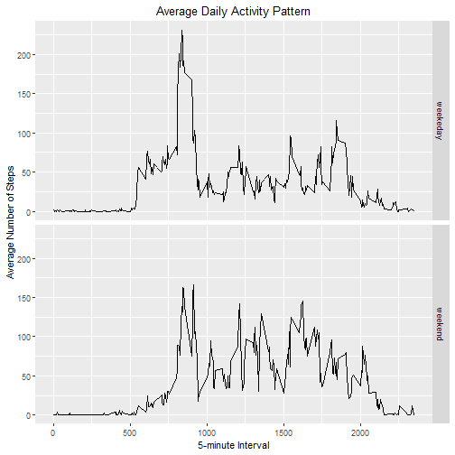

```r
activityData <- read.csv(file="C:/Users/HP/Documents/R/COURSE5/activity.csv", header=TRUE)
# Calculate the total steps taken per day
totalSteps <- aggregate(steps ~ date, activityData, FUN=sum)

# Make a histogram of the total number of steps taken per day
hist(totalSteps$steps,
     main = "Total Steps per Day",
     xlab = "Number of Steps")
```



```r
# Calculate and report the mean and median of total steps taken per day
meanSteps <- mean(totalSteps$steps, na.rm = TRUE)
medSteps <- median(totalSteps$steps, na.rm = TRUE)

print(paste0("Mean number of steps per day = ",meanSteps))
```

```
## [1] "Mean number of steps per day = 10766.1886792453"
```

```r
print(paste0("Median number of steps per day = ",medSteps))
```

```
## [1] "Median number of steps per day = 10765"
```


```r
# Make a time-series plot of the 5-minute interval and the average number of
# steps taken, averaged acoss all days.
library(ggplot2)
meanStepsByInt <- aggregate(steps ~ interval, activityData, mean)
ggplot(data = meanStepsByInt, aes(x = interval, y = steps)) +
  geom_line() +
  ggtitle("Average Daily Activity Pattern") +
  xlab("5-minute Interval") +
  ylab("Average Number of Steps") +
  theme(plot.title = element_text(hjust = 0.5))
```



```r
maxInt <- meanStepsByInt[which.max(meanStepsByInt$steps),]
print(paste0("Which 5-minute interval across all days contain the maximum number of steps: ",maxInt$interval))
```

```
## [1] "Which 5-minute interval across all days contain the maximum number of steps: 835"
```


```r
# Calculate and report the total number of missing values in the dataset
missingVals <- is.na(activityData$steps)

# Devise a strategy for filling in all of the missing values
print(paste0("There are ",sum(missingVals)," missing values. I will replace these missing values with the 5-day average of that respective interval."))
```

```
## [1] "There are 2304 missing values. I will replace these missing values with the 5-day average of that respective interval."
```

```r
# Create a new dataset that is equal to the original dataset but with 
# the missing data filled in.
imp_activityData <- transform(activityData,
                              steps = ifelse(is.na(activityData$steps),
                                             meanStepsByInt$steps[match(activityData$interval, 
                                                                        meanStepsByInt$interval)],
                                             activityData$steps))

# Make a histogram of the total number of steps taken each day and
# and report the mean and median.
impStepsByInt <- aggregate(steps ~ date, imp_activityData, FUN=sum)
hist(impStepsByInt$steps,
     main = "Imputed Number of Steps Per Day",
     xlab = "Number of Steps")
```



```r
impMeanSteps <- mean(impStepsByInt$steps, na.rm = TRUE)
impMedSteps <- median(impStepsByInt$steps, na.rm = TRUE)
diffMean = impMeanSteps - meanSteps
diffMed = impMedSteps - medSteps
diffTotal = sum(impStepsByInt$steps) - sum(totalSteps$steps)
print(paste0("There is a difference of ", diffMean," in the mean steps of the two dataset. There is a difference of ", diffMed, " in the median steps of the two dataset. There is a difference of ",diffTotal, " in the total steps of the two dataset."))
```

```
## [1] "There is a difference of 0 in the mean steps of the two dataset. There is a difference of 1.1886792452824 in the median steps of the two dataset. There is a difference of 86129.5094339623 in the total steps of the two dataset."
```


```r
# Create a new factor variable in the dataset with two levels - "weekend" and "weekday"
DayType <- function(date) {
  day <- weekdays(date)
  if (day %in% c('Monday', 'Tuesday', 'Wednesday', 'Thursday', 'Friday'))
      return ("weekeday")
  else if (day %in% c('Saturday', 'Sunday'))
      return ("weekend")
  else
      stop ("Invalid Date Format.")
}
imp_activityData$date <- as.Date(imp_activityData$date)
imp_activityData$day <- sapply(imp_activityData$date, FUN = DayType)

# Make a panel plot containnig a time-series plot of the 5-minute interval
# and the average number of steps taken across all weekdays or weekends
meanStepsByDay <- aggregate(steps ~ interval + day, imp_activityData, mean)
ggplot(data = meanStepsByDay, aes(x = interval, y = steps)) + 
  geom_line() +
  facet_grid(day ~ .) +
  ggtitle("Average Daily Activity Pattern") +
  xlab("5-minute Interval") +
  ylab("Average Number of Steps") +
  theme(plot.title = element_text(hjust = 0.5))
```


